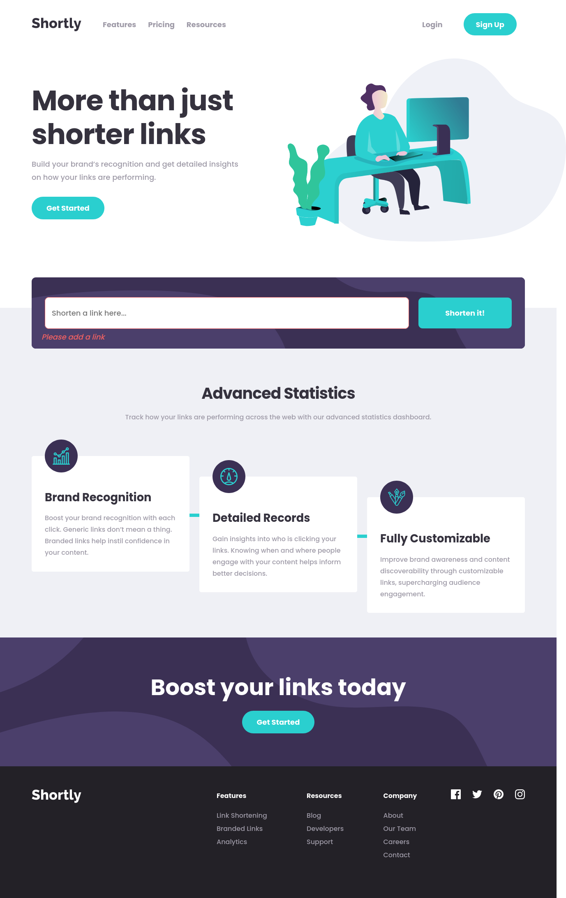

# Frontend Mentor - Shortly URL shortening API Challenge solution

This is a solution to the [Shortly URL shortening API Challenge challenge on Frontend Mentor](https://www.frontendmentor.io/solutions/html-css-and-js-using-fetch-api-iRXQ4nfAN). Frontend Mentor challenges help you improve your coding skills by building realistic projects. 

## Table of contents

- [Frontend Mentor - Shortly URL shortening API Challenge solution](#frontend-mentor---shortly-url-shortening-api-challenge-solution)
  - [Table of contents](#table-of-contents)
  - [Overview](#overview)
    - [The challenge](#the-challenge)
    - [Screenshot](#screenshot)
    - [Links](#links)
    - [Built with](#built-with)
    - [What I learned](#what-i-learned)
    - [Continued development](#continued-development)
  - [Author](#author)

## Overview

### The challenge

Users should be able to:

- View the optimal layout for the site depending on their device's screen size
- Shorten any valid URL
- See a list of their shortened links, even after refreshing the browser
- Receive an error message when the `form` is submitted if:
  - The `input` field is empty

### Screenshot

### Links

- Solution URL: [Add solution URL here](https://www.frontendmentor.io/solutions/html-css-and-js-using-fetch-api-iRXQ4nfAN)
- Live Site URL: [Add live site URL here](https://felixmacaspac.github.io/fem-url-shortener-website/)

### Built with

- Semantic HTML5 markup
- CSS custom properties
- Flexbox
- Mobile-first workflow
- Fetch API 
### What I learned

I learned to think outside the box before coding. I admit I have a lot of problems here especially with the animations and the tech stack I should use. but, lesson learned 😄

### Continued development

I still need to improve my JS skills.
## Author

- Frontend Mentor - [@yourusername](https://www.frontendmentor.io/profile/felixmacaspac)
